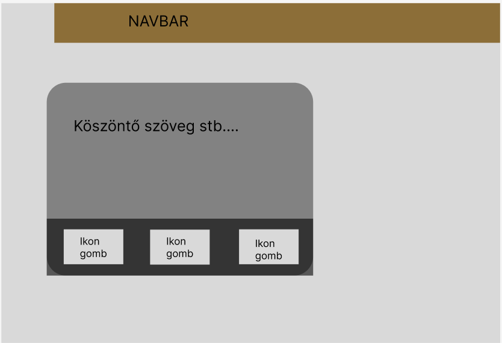
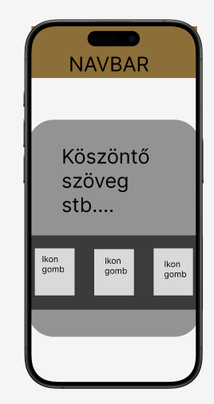
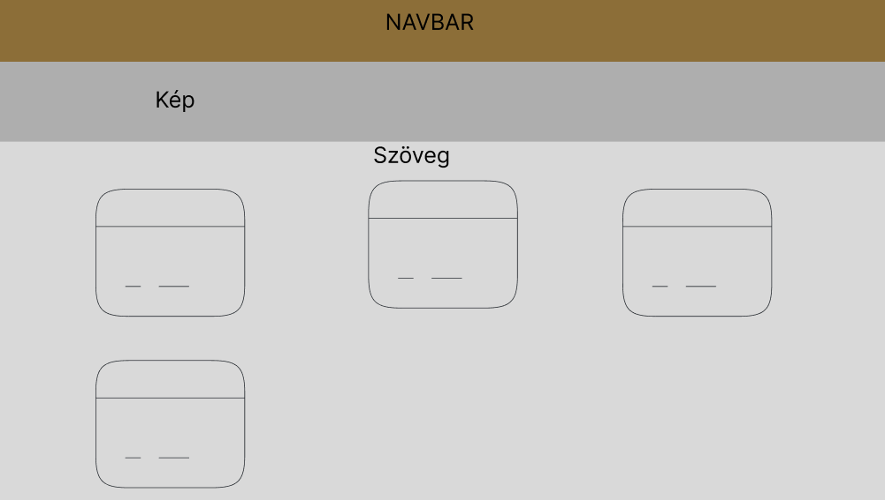
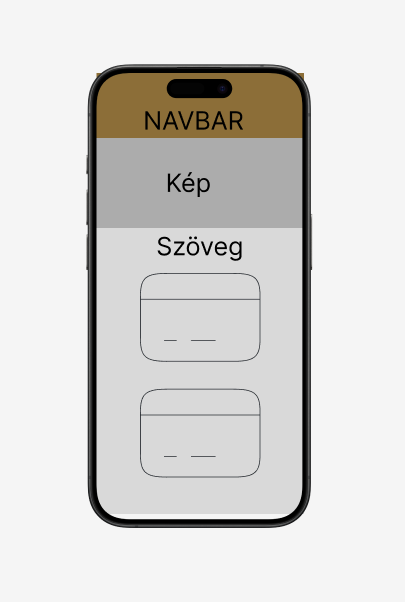

# Lucky kávézó 

## 📖 Leírás
Ez a projekt a Lucky Kávézó weboldalának felújítására irányul, amely magában foglalja a modern webdizájn elemek integrálását, a HTML és CSS optimalizálását, valamint JavaScript funkciók hozzáadását a felhasználói élmény javítása érdekében.

---

## 🚀 Célok
- Friss, modern és reszponzív dizájn létrehozása.
- Weboldal optimalizálása
- Jobb felhasználói élmény biztosítása interaktiv navigációval.
- JavaScript alapú interaktív funkciók bevezetése (pl. dinamikus menük).

---

## 🛠️ Használt eszközök
- **Visual studio** : Az általunk preferált fejlesztői környezet.
- **HTML5**: A weboldal alapstruktúrájához.
- **CSS3**: A vizuális megjelenés kialakításához.
- **JavaScript**: Interaktív elemek és dinamikus funkciók implementálásához.
- **Trello**: A projekt dokumentálásához.ű
- **Teams** : Kommunikációs és file megosztásos célokból

---
## 🖥️ Drótváz
- **Főoldal**

<p align="center" style="display: flex; justify-items: center; justify-content: center; justify-self: center; gap: 500px; height: 200px;">
  
  
</p>

<br>
<br>

- **Sütemények és Kávéfajták**

<p align="center" style="display: flex; justify-items: center; justify-content: center; justify-self: center; gap: 500px; height: 200px;">
  
  
</p>

## 🔧 Telepítés és futtatás
1. Klónozd a projektet:
   ```bash
   git clone https://github.com/your-repository-link.git

